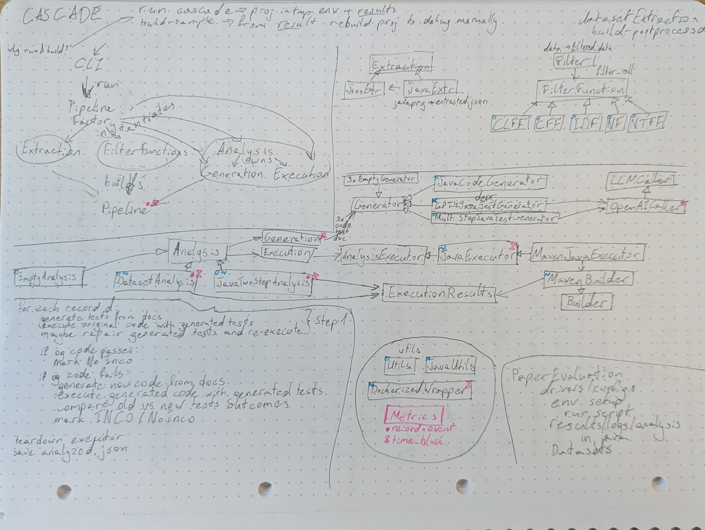

# Konzeptabgabe

**Themenbereich**: LLM Performance Vergleich (Feature Realisation)
**Werkzeug**: [CASCADE](https://github.com/TobiasKiecker/CASCADE)
**Gruppenmitglieder**: Bruno Vincent Hemoura, Alexander Hristov, Caspar Moritz Klein
**Gruppe**: 01 

# Forschungsfrage

Wie kann CASCADE so erweitert werden, dass LLM-Nutzung und Laufzeitverhalten der Pipeline strukturiert erfasst werden, um verschiedene Modelle, Prompts und Ausführungsschritte vergleichbar zu machen?

# Abstract

CASCADE generiert und validiert Tests mithilfe einer mehrstufigen Pipeline aus Extraktion, Analyse, Generierung und Ausführung. Für einen fundierten LLM-Performance-Vergleich fehlte bisher eine zentrale Erfassung von Tokenverbrauch, Laufzeiten und Fehlern. Im Rahmen dieser Feature-Realisierung wurde ein leichtgewichtiger Metrics-Mechanismus für `src/cascade` implementiert. Er protokolliert Events als JSON Lines, erzeugt am Ende eines Runs eine Zusammenfassung und misst gezielt LLM-Aufrufe sowie zentrale Pipeline-Schritte.

# Motivation

LLM-basierte Testgenerierung ist stark abhängig von Modell, Prompting, Eingabegröße und Ausführungsumgebung. Ohne einheitliche Metriken ist schwer nachvollziehbar, ob ein Modell tatsächlich bessere Ergebnisse liefert oder nur höhere Kosten bzw. längere Laufzeiten verursacht. Ziel ist daher eine reproduzierbare Messgrundlage, mit der Tokenverbrauch, Dauer, Fehler und zentrale Teilschritte der CASCADE-Pipeline objektiv verglichen werden können.

Zusätzlich ist die Erweiterung des Loggings auch sinnvoll, weil CASCADE dadurch nicht nur Endergebnisse, sondern auch deren Entstehung nachvollziehbar macht. So können Unterschiede zwischen Modellen oder Konfigurationen später anhand konkreter Messwerte statt nur anhand beobachteter Resultate bewertet werden.

# Lösungsansatz

Vorgesehen ist ein leichtgewichtiges Metrics-Konzept, das pro CASCADE-Run strukturierte Ereignisse erfasst und anschließend aggregierte Kennzahlen bereitstellt. Dabei sollen sowohl LLM-spezifische Daten wie Input-, Output- und Total-Tokens als auch allgemeine Performance-Daten wie Laufzeit, Fehler und Pipeline-Phase berücksichtigt werden.

Die Erfassung soll möglichst nah an den relevanten Pipeline-Schritten ansetzen, ohne die bestehende CASCADE-Architektur stark zu verändern. Sinnvoll ist eine Kombination aus expliziten Events für fachliche Informationen und Zeitmessungen für größere Ausführungsblöcke. Kontextinformationen wie Phase, Methode oder Sample sollen automatisch mitgeführt werden, damit die Messdaten später einem konkreten Pipeline-Schritt zugeordnet werden können.

TODO: <Loggingansatz>

# Skizze

